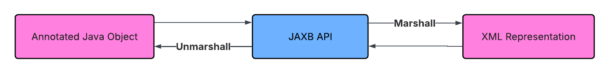

# JAXB Taster

JAXB Taster is a minimal Java 11/Maven project demonstrating JAXB (Jakarta XML Binding). It shows how to marshal Java objects into XML, unmarshal XML back into Java objects, write a round-trip JUnit test, and understand the annotations required by JAXB. The project is intended for developers learning JAXB without the complexity of a production application.

This taster uses Java 11 and Maven 3.9.x, specifically version 3.9.16 


## What is JAXB?
JAXB (Java API for XML Bindings) lets you convert (marshall )Java objects to XML and back (unmarshal) with just a few annotations. 

<p>
  
</p>


JAXB was originally part of the Java EE specifications but now is no longer bundled with the JDK. It is now part of the Eclipse Foundation under the Jakarta EE umbrella.
The Jakarta EE is the open-source, vendor-neutral standard for cloud-native1 enterprise Java applications. 

### Why was JAXB removed from Java EE?
It was originally bundled into Java SE 6 to make Web Services more accessible and easy to use but never really belonged there. JAXB was moved into the `java.xml.bind` module to reduce the weight of the core IDE, allowing Java SE and JAXB to evolve independently. It was moved into the open-source governance of Eclipse as Jakarta XML Binding.

### Public API vs Reference Implementation
Modern Java applications typically use two JAXB dependencies. The `jakarta.xml.bind-api` artifact provides the public API that your application imports, while `org.glassfish.jaxb:jaxb-runtime` is the reference implementation that performs the actual marshaling and unmarshaling. Separating the API from its implementation allows different JAXB implementations to exist while applications continue to program against the same standard API.


## Why should I use it?
JAXB is a fast, easy-to-implement framework. Personally, I love it and it is fun to use.

## Quick Example
Create a new person:
`Person person = new Person("Stevie", 42, 22134);`
into XML:
```
Transform the person 
<person>
    <name>Stevie</name>
    <age>42</age>
    <id>22134</id>
</person>
```
Then transform the XML back into a Java object and show it in its `String` representation:

`Person{name='Stevie', age=42, id=22134}`

## What You'll Learn

After completing this project, you'll understand:

• How JAXB annotations map Java objects to XML.
• How to marshal and unmarshal objects.
• Why a no-argument constructor is required.
• Why equals() and hashCode() matter.
• How to write a simple JUnit round-trip test.
• How Maven builds and runs a Java project.

## Project Structure

```
├── src
│   └── main
│        └── java
│            └── com.steveomurphy.tasters.jaxb
│                ├── Main.java
│                └── Person.java                                     
├── test
│    └── java
│         └── PersonTest.java
├── .gitignore
│
└── CONTRIBUTING.md
│
└── LICENSE
│
└── pom.xml
│
└── README.md
```


## Key Classes

### Main.java
This class contains the `main` method. It creates a `Person` object, then marshals it into XML and prints the XML representation.
Then it unmarshals the XML back into a `Person` object.

`Main.java` also has JAXB-specific annotations discussed in `Interesting Things to Notice` 

### Person.java
This is a humble domain class with just instance variables and two constructors, and annotations. 

We override `toString()`, `equals()`, and `hashCode()`. These methods make debugging easier and allow unit tests to compare two Person objects by value rather than by object identity.

## Interesting Things to Notice
Q: Why does JAXB require a no-argument constructor?

A: During unmarshaling, JAXB needs to create an empty instance before populating its fields. That's why every JAXB class must provide a public or protected no-argument constructor.

Q: What are all those annotations? 

A: Those are specific to JAXB. Here are a few explanations:

`XmlAccessorType`--Whether fields or Javabean properties are serialized by default

`XmlAccessType`--Controls serialization of fields or properties

`XmlRootElement`--Maps the class to an XML element


## Run It Yourself

It's easy--you can run it within your IDE by executing the `main` method in `Main.java`.
Or, you can run it from the console with this command: `mvn exec:java`.

Set a breakpoint on the line that creates the `JAXBContext` and another immediately after unmarshalling. Notice that the two `Person` objects have different identities but identical values.

## Run tests
With maven installed, it's straightforward. Just run `mvn test`.

## Have Fun with It!

This is what I love about projects--you can dream up all sorts of enhancements. (Next thing I know, I'm spending way too much time and I have to reign myself in.)

**Novice Level** 

Add another instance variable to `Person.java`.

Quiz--what else must you do to `Person.java`?

Run the application again. Observe that the new attribute is automatically added to the XML representation.

---

**Expert Level**

Have even more fun. Create an `Order` class with one attribute `orderNumber`. Make it an `int`. Annotate the class.

Modify `Person.java` to have a `List` of `Order` objects. You'll have to do several things in the class to make this work.

Modify `Main.java` accordingly and run the application.

In the output, what do you notice about the XML representation that looks odd?
To fix it, you will have to do a lot of research on needed annotations.

HINT: if you have a good IDE, you can hover over JAXB annotations and learn quite a bit.

## Further Reading 


## Maven Lifecycle Commands

If you are new to Maven, here are some basic commands you can use:

* Build the project: `mvn clean package`

* Run the application: `mvn exec:java`

* Run the unit tests: `mvn test`

## Create a jar File

Create a `jar` file with this command: `mvn package`.

When you run that command, Maven creates a `Target` directory at the root of the project, and the last entry is the jar file `jaxb-taster-1.0-SNAPSHOT.jar` 

Note that you can't run the project from the file because it doesn't contain the project dependencies. JAR files are the standard packaging format for Java applications and libraries. Libraries are often published to Maven repositories, while applications may be distributed directly or bundled with their dependencies into an executable JAR.

It is possible to make the jar file executable, but you need another plugin, which is beyond the scope our project.

## Why Did I Create this Project?

Back in the mid-to-late 1990s, Java was exploding and there were libraries for every imaginable purpose. I remember being amazed at the diversity. Also, XML was coming into being which I loved because it showed hierarchies. (I’m fascinated by JSON and YAML for the same reason.)
As I looked at production code, I noticed JAXB and tried piecing together the details. But the real-life usages had many tightly coupled components, and it was hard to sort out.

## What did I learn?
Lots, not only about JAXB and its nomadic history, but also some quirky things like authoring a README file. I originally did the writeup in Word, but when I copy/pasted content into this README, the Markdown engine interpreted it as an image, added the image to the project, and inserted a reference to it like this: 

``

I realized I had to paste the word content into a text editor like notepad, then copy/paste from notepad to the README.
